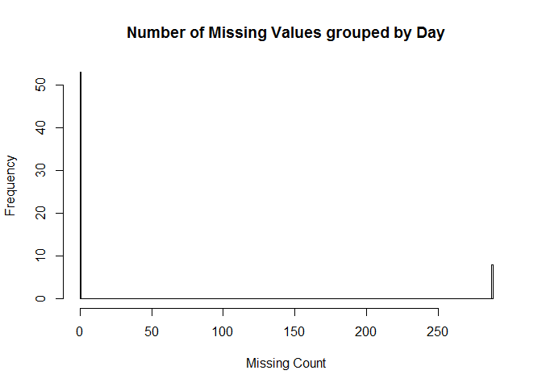
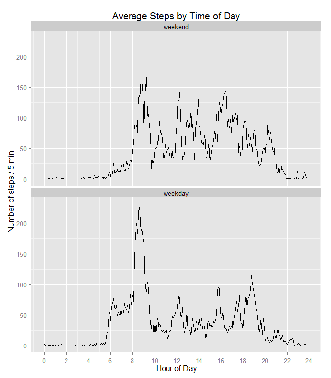

# Reproducible Research: Peer Assessment 1

## Loading and preprocessing the data

Read the data directly from the given .zip file.


```r
act <- read.csv(unz("activity.zip", "activity.csv"))
```

Clean up the data as needed.

```r
# convert date to R Date
act$rDate <- as.Date(act$date)

# Convert the "interval" to minute of the day. This is useful
# when plotting because using "interval" directly will cause
# meaningless spaces where interval skips from 55 to 100,
# from 155 to 200, etc., at the end of each hour. Without this
# correction, plots look jagged (almost angry) where the spaces
# (which take up 40% of the x axis) are connected by straight
# lines.
minutes <- act$interval %% 100  # the last 2 digits
hours <- act$interval %/% 100   # without last 2 digits
act$Minute <- hours * 60 + minutes # *60 converts hours to minutes
```

The first three rows of Activity data are:


```r
head(act, 3)
```

```
##   steps       date interval      rDate Minute
## 1    NA 2012-10-01        0 2012-10-01      0
## 2    NA 2012-10-01        5 2012-10-01      5
## 3    NA 2012-10-01       10 2012-10-01     10
```

Note the difference in the hour transition of Interval vs. Minute


```r
act[11:14,]
```

```
##    steps       date interval      rDate Minute
## 11    NA 2012-10-01       50 2012-10-01     50
## 12    NA 2012-10-01       55 2012-10-01     55
## 13    NA 2012-10-01      100 2012-10-01     60
## 14    NA 2012-10-01      105 2012-10-01     65
```

## What is mean total number of steps taken per day?


```r
stepsPerDay <- aggregate(steps ~ date,  act, sum)

hist(stepsPerDay$steps,
    main="Total Number of Steps Taken per Day",
    xlab="Steps")
```

 

```r
meanSteps <- mean(stepsPerDay$steps, na.rm=TRUE)
medianSteps <- median(stepsPerDay$steps, na.rm=TRUE)
```
**Mean steps:** 10766.2
**Median steps:** 10765


## What is the average daily activity pattern?


```r
avgStepsByMinute <- aggregate(steps ~ Minute, act, mean)

plot(avgStepsByMinute, type="l", xaxt="n",
    main="Average Steps by Time of Day",
    xlab="Hour of Day",
    ylab="Number of steps per 5 minutes")

# Label the X axis by hour of day (only labeling even hours)
axis(1, at=seq(0, 24*60, 60*2), labels=seq(0, 24, 2))
```

 


```r
maxRow <- avgStepsByMinute[which.max(avgStepsByMinute$steps),]
maxRow
```

```
##     Minute    steps
## 104    515 206.1698
```

```r
maxMinute <- maxRow$Minute
maxTime <-sprintf("%02d:%02d", maxMinute%/%60, maxMinute%%60)
maxSteps <- sprintf("%.1f", maxRow$steps)
```

The 5 minute interval with the greatest average number of steps occurs at
**08:35**. The average number of steps for this interval was
**206.2**.


## Imputing missing values

### Calculate and report the total number of missing values in the dataset


```r
missing <- !complete.cases(act)
missingCount <- sum(missing)
missingPct <- 100 * missingCount / length(missing)
missingPctFmt <- sprintf("%.1f%%", missingPct)
```
There are 2304 missing rows (rows with any missing values) out of a
total of 17568total rows (13.1% missing values).


```r
missingByDay <- aggregate(missing,  list(act$date), sum)
names(missingByDay) <- c("date", "missingCount")

hist(missingByDay$missingCount, breaks=max(missingByDay$missingCount),
    main="Number of Missing Values grouped by Day",
    xlab="Missing Count")
```

 

```r
barplot(missingByDay$missingCount, names.arg=missingByDay$date,
    main="Number of missing values by Day",
    xlab="Date", ylab="Missing Count")
```

 

```r
missingDayCount = sum(missingByDay$missingCount == 24*12)
fullDayCount = sum(missingByDay$missingCount == 0)
partialDayCount = sum(
    0 < missingByDay$missingCount &
    missingByDay$missingCount < 24*12)
```
**Total Number of Days:** 61
**Number of Full Days:** 53
**Number of Partial Days:** 0
**Number of Missing Days:** 8

```r
pie(
    c(fullDayCount, partialDayCount, missingDayCount),
    c("Full Day", "Partial Day", "Missing Day"),
    main="Day Missing Status" )
```

 

### Devise a strategy for filling in all of the missing values in the dataset.

Two simple strategies for filling in missing values were suggested:

1. Use the mean/median for that day
2. Use the mean for that 5-minute interval

Using the mean for the day doesn't work for missing day so that's not a good
choice in this case. Filling in using the mean for the interval for the time of
day seems like a reasonable choice (considering the request to keep it simple),
so that's the strategy that has been implemented.

### Create a new dataset that is equal to the original dataset but with the missing data filled in.


```r
actFilled <- act
fillMinuteIdx <- match(actFilled[missing, "Minute"], avgStepsByMinute$Minute)
actFilled[missing, "steps"] <- avgStepsByMinute[fillMinuteIdx, "steps"]

## head(actFilled)
## head(avgStepsByMinute)
```

### Make a histogram of the total number of steps taken each day and Calculate  and report the mean and median total number of steps taken per day.


```r
stepsPerDayFilled <- aggregate(steps ~ date,  actFilled, sum)

hist(stepsPerDayFilled$steps,
    main="Total Number of Steps Taken per Day (w/Missing Filled)",
    xlab="Steps")
```

 

```r
meanStepsFilled <- mean(stepsPerDayFilled$steps)
medianStepsFilled <- median(stepsPerDayFilled$steps)
```
**Mean steps (filled):** 10766.2
**Median steps (filled):** 10766.2

####Do these values differ from the estimates from the first part of the assignment?

```r
noDiff <- TRUE

if (meanStepsFilled != meanSteps) {
    noDiff <- FALSE
    sprintf("The original mean was %f, the filled mean is %f.",
        meanSteps, meanStepsFilled)
}

if (medianStepsFilled != medianStepsFilled) {
    noDiff <- FALSE
    sprintf("The original median was %f, the filled median is %f.",
        medianSteps, medianStepsFilled)
}

if (noDiff) {
    "There is no difference in the mean and median of the filled data vs. the original data."
}
```

```
## [1] "There is no difference in the mean and median of the filled data vs. the original data."
```

#### What is the impact of imputing missing data on the estimates of the total daily number of steps?

While the strategy used to fill in missing values should have only a minor
effect on mean and median steps, the total number of steps will be directly
increased by the filled in values.


```r
totalMissingSteps <- sum(actFilled[missing, "steps"])
```

2304 missing values were filled in with a total
of 86129.5 steps.


```r
actOnlyFilled <- actFilled
actOnlyFilled[!missing, "steps"] <- 0
stepPerDayOnlyFilled <- aggregate(steps ~ date, actOnlyFilled, sum)

barplot(stepPerDayOnlyFilled$steps, names.arg=stepPerDayOnlyFilled$date,
    main="Number of filled (imputed) steps by Day",
    xlab="Date", ylab="Steps")
```

 

## Are there differences in activity patterns between weekdays and weekends?


```r
# To produce a better looking plot that more closely matches the provided
# template, switch to ggplot2 (base plot does not perform well for this task).

library("ggplot2", quietly = TRUE, verbose = FALSE)
```

```
## Warning: package 'ggplot2' was built under R version 3.1.2
```

```r
# Create a new factor variable in the dataset with two levels "weekday"
# and "weekend" to indicate whether a given date is a weekday or weekend day.

isWeekday <- !(weekdays(actFilled$rDate, abbreviate=TRUE) %in% c("Sat", "Sun"))
actFilled$dayType <- factor(isWeekday, c(FALSE,TRUE), c("weekend", "weekday"))

# Make a panel plot containing a time series plot of the 5-minute
# interval (x-axis) and the average number of steps taken, averaged
# across all weekday days or weekend days (y-axis).

avgStepsPerMinuteByDayType <- aggregate(steps ~ Minute + dayType, actFilled, mean)

ggplot(avgStepsPerMinuteByDayType, aes(Minute/60, steps)) +
    geom_line() +
    facet_wrap(~dayType, ncol=1)  +
    xlab("Hour of Day") +
    ylab("Number of steps / 5 min") +
    ggtitle("Average Steps by Time of Day") +
    scale_x_continuous(breaks = seq(0, 24, by = 2))
```

 

My understanding is the example plot was given as a way to describe what data was
required rather than to proscribe exact formatting (they specifically said any
plotting package could be used).  This chart doesn't exactly match the
aesthetics of the example chart, but I believe it provides the full analytic
value.  I've kept my x axis labels, "Hour of Day", because I believe they are
more descriptive and immediately obvious than the labels in the example.

## BONUS chart showing the difference in average steps weekend vs weekday.


```r
library(reshape2)

stepsAcrossDayType <- dcast(avgStepsPerMinuteByDayType, Minute ~ dayType, mean, value.var = "steps")

ggplot(stepsAcrossDayType, aes(Minute/60, weekend-weekday)) +
    geom_line()  +
    xlab("Hour of Day") +
    ylab("Change in average steps / 5 min") +
    ggtitle("Difference (Weekend-Weekday) Average Steps by Time of Day") +
    scale_x_continuous(breaks = seq(0, 24, by = 2))
```

 

The current data clearly shows several unsurprising features. The week
day starts 3 hours earlier at 6 for week day vs 9 for weekend.  After that
weekend days are generally more active, and remain active till about 10 PM which
is 2 hours later than the 8 PM slow down for weekdays.
